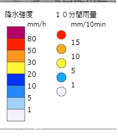

# Weather-JMA

本プログラムは，Yahoo気象情報APIのレスポンスと互換性を持つ雨雲レーダAPIです．  
データのソースは気象庁高解像度ナウキャストから取得しています．  
本APIのエンドポイント仕様は以下のとおりです．
```
http://localhost:8080/api/weather/V1/place
```
|クエリ文字列|値|
|--|--|
|lat|緯度|
|lon|経度|

レスポンス：

todo...

サンプルクエリ：
```
http://localhost:8080/api/weather/V1/place?lat=34.714692&lon=135.610513
```

## 気象庁の高解像度ナウキャストのAPI仕様
APIのエンドポイントは次の書式である．

```
https://www.jma.go.jp/bosai/jmatile/data/nowc/{baseTime}/none/{validTime}/surf/hrpns/{zoomLevel}/{x}/{y}.png

zoomLevel:縮尺を示す．（このAPIでは1~14の値を取る）
validTime:観測起点時間から予測された気象の時間（後述）
baseTime:観測起点時間（後述）
x:タイル座標X
y:タイル座標Y
```
### BaseTimeとValidTime
baseTimeは観測起点時間で，validTimeは，観測起点時間から見た気象を予測された時間となっている．
予測は5分ごとに更新され，値は次のJSONから得ることができる．
`https://www.jma.go.jp/bosai/jmatile/data/nowc/targetTimes_N2.json`
なお，UTC基準となっているため，時差が-9時間となっている．

### タイル座標
タイル座標とは，地球を単位256*256ピクセルに分割した座標のことで，縮尺によっても，値はかわる．
計算式は次を参考に．
`https://www.trail-note.net/tech/coordinate/`

### 得られる画像
APIから得られる画像は，降水強度ごとに色が分かれている．
気象庁の凡例を参考にのせておく．


